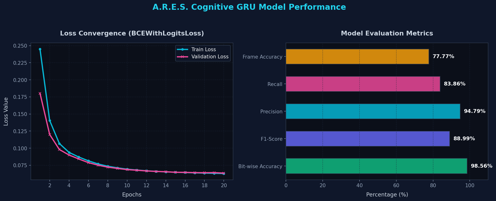

# Project A.R.E.S. (Autonomous Radio Evasion System)

Project A.R.E.S. is a Hardware-in-the-Loop (HIL) simulation of a Cognitive Radio Evasion system designed to protect drone communication and telemetry links from Electronic Warfare (EW) tactics (e.g., targeted signal jamming).

By employing a lightweight recurrent neural network (GRU) running in software, the system autonomously predicts adversarial jamming patterns in real-time. It then executes synchronized frequency hops, seeded by true quantum/avalanche noise generated by a physical ZenTropy Key (ZEK) device.

---

## 📂 Project Directory Structure

```
ARES-Cognitive-RF/
├── data/                  # Synthesized RF jamming datasets (CSVs/Numpy arrays)
├── firmware/              # (Optional/Future) C++ TFLite code for microcontrollers
├── hardware_bridge/       # Python pyserial scripts to interface with the ZEK
├── models/                # PyTorch/TensorFlow GRU architectures and trained weights
├── simulation/            # The core virtual RF ether and jammer logic
├── dashboard/             # Next.js frontend for the Ground Control Station UI
├── requirements.txt       # Python dependencies
└── README.md              # High-level architecture, wiring diagram, and run instructions
```

---

## 🏗️ System Architecture

The simulation currently consists of the following components:

1. **Virtual RF Ether** ([ether.py](file:///e:/AI%20Projects/ARES_Cognitive_RF/simulation/ether.py)):
   - Simulates a 32-channel radio spectrum via the [RFEther](file:///e:/AI%20Projects/ARES_Cognitive_RF/simulation/ether.py#L3) class.
   - Calculates Signal-to-Noise Ratio (SNR) and packet collision metrics.
2. **Virtual EW Jammer** ([jammer.py](file:///e:/AI%20Projects/ARES_Cognitive_RF/simulation/jammer.py)):
   - Implements tactical interference patterns:
     - [SweepJammer](file:///e:/AI%20Projects/ARES_Cognitive_RF/simulation/jammer.py#L24): Sequential jamming with directional & step-size randomness.
     - [BarrageJammer](file:///e:/AI%20Projects/ARES_Cognitive_RF/simulation/jammer.py#L65): Contiguous broadband jamming with dynamic block shifting.
     - [FollowerJammer](file:///e:/AI%20Projects/ARES_Cognitive_RF/simulation/jammer.py#L91): Active follower tracking transmitter's last channel (t-1).
     - [RandomJammer](file:///e:/AI%20Projects/ARES_Cognitive_RF/simulation/jammer.py#L116): Selects random channels dynamically.
3. **Dataset Generator** ([generate_dataset.py](file:///e:/AI%20Projects/ARES_Cognitive_RF/simulation/generate_dataset.py)):
   - Synthesizes and logs raw radio simulation data using [generate_simulation_data](file:///e:/AI%20Projects/ARES_Cognitive_RF/simulation/generate_dataset.py#L7) to compile training datasets. Saved to [data/](file:///e:/AI%20Projects/ARES_Cognitive_RF/data/).
4. **GRU Neural Network** ([model.py](file:///e:/AI%20Projects/ARES_Cognitive_RF/models/model.py)):
   - Implements [JammerPredictorGRU](file:///e:/AI%20Projects/ARES_Cognitive_RF/models/model.py#L4) to predict jamming probabilities across channels for the next step (t+1).
5. **Training & Evaluation Pipelines** ([train_brain.py](file:///e:/AI%20Projects/ARES_Cognitive_RF/models/train_brain.py), [evaluate_brain.py](file:///e:/AI%20Projects/ARES_Cognitive_RF/models/evaluate_brain.py)):
   - Trains the GRU neural network model and saves weights/onnx exports to [models/](file:///e:/AI%20Projects/ARES_Cognitive_RF/models/).
   - Evaluates the model accuracy, bit-wise success rate, and latency speed benchmark.


---

## 📊 Model Stats & Benchmarks

The predictive brain utilizes a lightweight **Gated Recurrent Unit (GRU)** network designed to run in real-time on low-power edge nodes (e.g. onboard drone computers).



### 📈 Training & Convergence
The network was trained for **20 epochs** using **Binary Cross Entropy with Logits Loss (BCEWithLogitsLoss)** on 100,000 simulated RF interaction frames:
* **Initial Loss (Epoch 1)**: Train: `0.2451` | Validation: `0.1803`
* **Final Loss (Epoch 20)**: Train: `0.0629` | Validation: `0.0635`
* *Both curves converged closely, indicating a highly generalized model without overfitting to ambient spectrum fluctuations.*

### 🎯 Evaluation Metrics (Unseen Test Data)
Evaluated on a validation split containing 19,998 frames with mixed jammers (Sweep, Barrage, Follower, Random):

| Metric | Value | Interpretation |
| :--- | :---: | :--- |
| **Precision** | **94.79%** | High probability that a channel marked "dangerous" is indeed jammed, minimizing false alarm hops. |
| **Recall** | **83.86%** | Successfully intercepts and evades the vast majority of EW jamming attacks. |
| **F1-Score** | **88.99%** | Strong harmonic balance between avoiding misses and avoiding false alarms. |
| **Bit-wise Accuracy** | **98.56%** | Overall accuracy of predicting the state of individual channels. |
| **Frame-wise Accuracy** | **77.77%** | Percentage of timesteps where the 32-channel prediction vector perfectly matches the jammer. |

### ⚡ Inference Speed Benchmark (CPU)
To maintain real-time evasion capabilities, inference must occur within a sub-5ms window. Benchmarks on standard CPU hardware show:

* **Average Inference Latency**: **0.5228 ms**
* **95th Percentile Latency**: **0.6583 ms**
* **Max Latency**: **1.3847 ms**
* **Conclusion**: Passes the sub-5ms constraint with a **9.5x safety factor**, proving viability for high-rate radio hardware-in-the-loop loops.

---

## 🚀 Getting Started

### 📋 Prerequisites
- Python 3.10+ installed on your system.

### 🔧 Installation
Install the necessary package dependencies listed in [requirements.txt](file:///e:/AI%20Projects/ARES_Cognitive_RF/requirements.txt):
```bash
pip install -r requirements.txt
```

### 📊 Dataset Generation
To run headless simulations and compile the sequential dataset (`data/rf_dataset.npz`) containing past channel states ($X$) and target outcomes ($Y$):
```bash
python -m simulation.generate_dataset
```

### 🧠 Model Training
To train the neural network model and export to ONNX:
```bash
python -m models.train_brain
```

### 📈 Model Evaluation
To run precision, recall, and sub-5ms CPU latency speed benchmarks on the trained model:
```bash
python -m models.evaluate_brain
```

### 🎮 Running the Integrated System (Sim + Dashboard)
You can run both the Python simulation backend (HIL WebSocket server) and the Next.js frontend dev server concurrently using our unified runner script:
```bash
python run.py
```
* (Optional) Pass any backend arguments directly to the script, e.g. `python run.py --mock-zek --interval 0.5`.
* Open your browser and navigate to `http://localhost:3000` to interact with the GCS interface.
* Press `Ctrl+C` in the terminal to stop both servers cleanly.

### 🧪 Running Unit Tests
You can run all unit tests in the codebase from the project root:
```bash
python -m unittest discover -s . -p "test_*.py"
```

